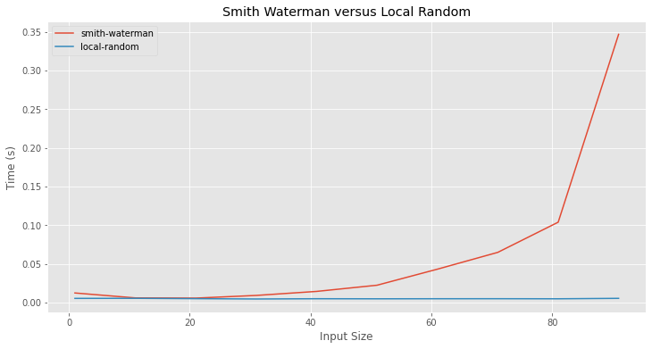
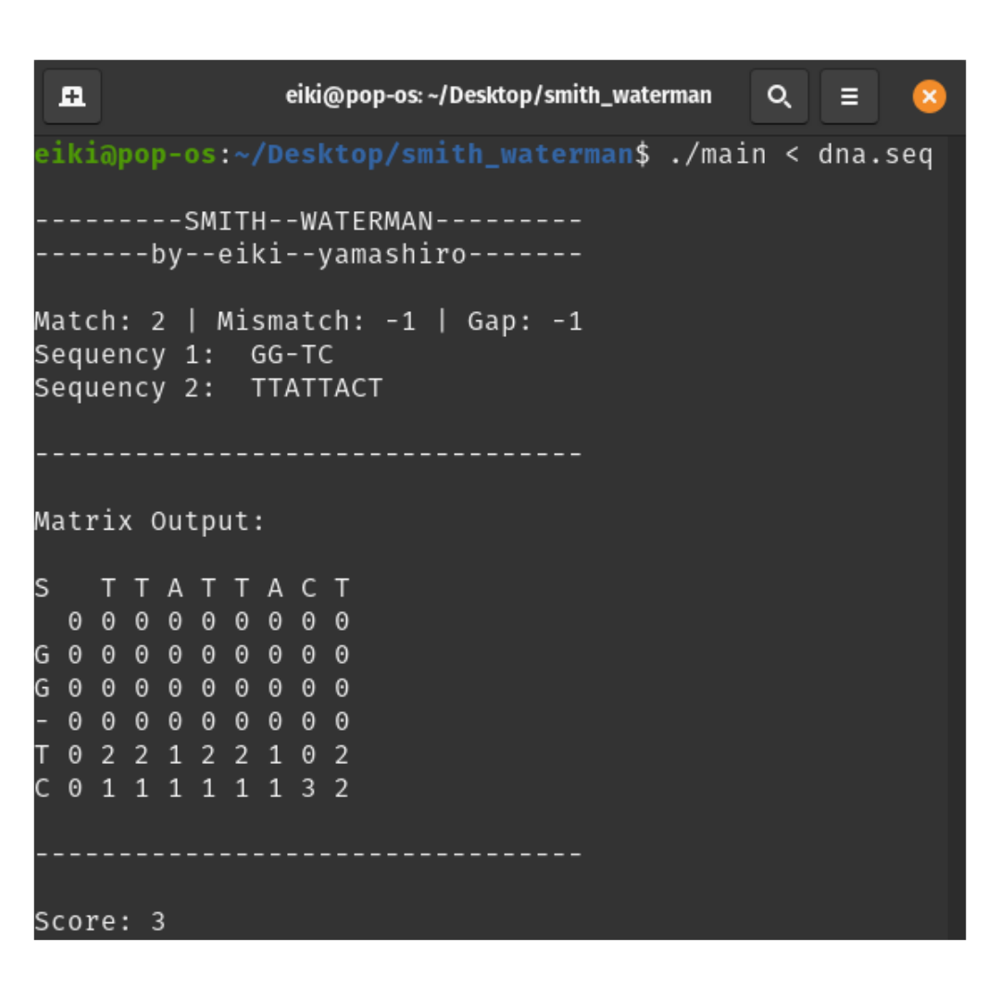

# DNA ALIGNMENT

### Projeto de Super Computação
### Aluno: Eiki Luis Yamashiro

Resultado obtido:

A pasta *algorithms* contem os arquivos .cpp dos algoritmos, e seus executáveis. Note que nesta pasta os executáveis possuem um output mais completo como mostrado na figura abaixo:

A pasta *compare* contem os arquivos .cpp dos algoritmos, e seus executáveis utilizados no jupyter notebook SequenceGenerator.ipynb para a comparacao dos resultados.

A pasta *inputs* contem os .seq gerados no jupyter notebook SequenceGenerator.ipynb.

